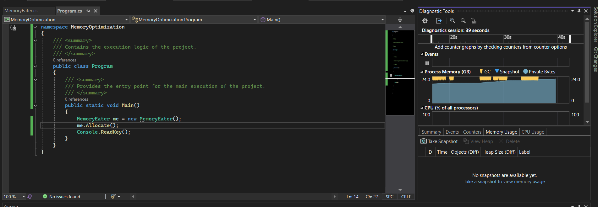
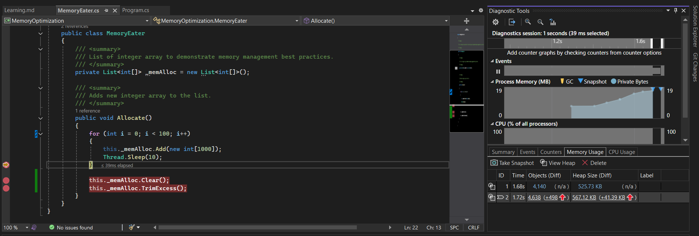
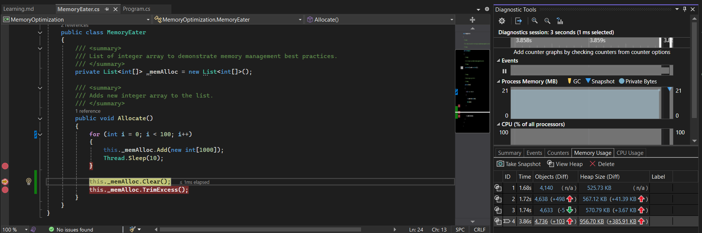
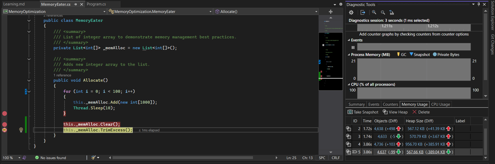
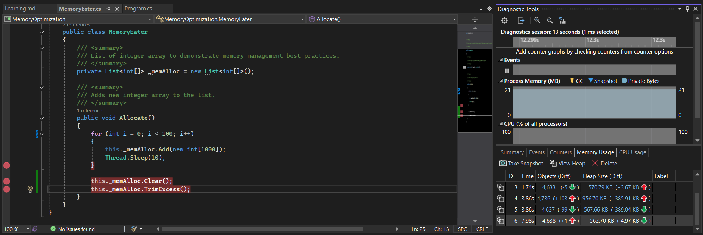
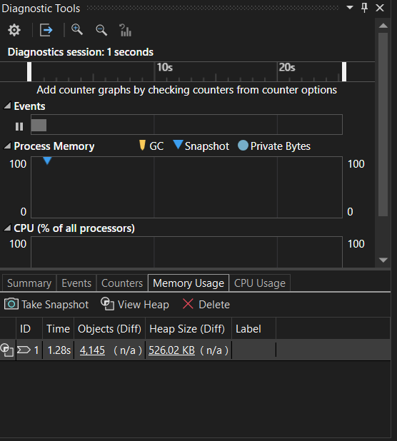

# Memory Optimization in C#

- Objective of this project is to understand how to detect, diagnose, and resolve memory issue.

## Detect

- To detect the memory issue there are various ways,


    * CPU usage spikes to near 100%, but the application is non-responsive. This happens because the CPU spends all its time running the Garbage Collector instead of executing code.
    * OutOfMemoryException (OOM): The application crashes with an OutOfMemoryException.


## Diagnose 

- When we detect there is a memory issue, we should diagnose how it is caused and from where it is caused.
- It can be done by capturing different snapshots and comparing the heap difference by keeping breakpoints or within some interval of time.
- Run your application and let it reach a steady state. Take a memory snapshot (Snapshot A) using Visual Studio.
- Perform the action that you suspect causes the issue (e.g., let your loop run for a few seconds or call the Allocate() method multiple times).
- Take another memory snapshot (Snapshot B). Compare the heap difference.

## Resolve 

- Once after finding the memory issue take necessary procedure to resolve those issues.


## Memory Profiling

- It is the process of monitoring, analyzing and optimizing the application's memory usage.
- It helps in the detection and prevention of issues such as:
  - Memory leaks
  - Excessive allocations
  - Inefficient object lifetimes

## Garbage Collection

- It automatically frees up the unused memory.
- Triggered when memory allocation is required and the system is experiencing high memory pressure.


## Diagnostic tool

- The Diagnostic Tools window in Visual Studio provides real-time performance profiling for C# applications, allowing developers to monitor CPU usage, memory allocation, and critical runtime events while debugging.
- *Memory Graph:* Displays a real-time line graph of your application's private bytes (the physical RAM reserved exclusively by your program).
- *Garbage Collection (GC) Markers:* Visual indicators (typically yellow bars) that mark exactly when the .NET Garbage Collector triggered a collection pass to free up unused memory.
- *CPU Utilization Graph:* Displays a percentage graph showing how much processing power your application is drawing across all available CPU cores.
- *Take Snapshot:* A button that captures a frozen picture of the .NET Managed Heap at that exact millisecond. It records every object currently alive in memory.
- *Heap Size (Diff):* Shows the total size of the heap. When you take multiple snapshots, it automatically calculates the size difference to show if memory is growing or shrinking.
- *Objects (Diff)* tells you exactly how many new items your program has made.


### Task 1

- To identify and diagnose memory issues in a C# program.

  ```
    public class MemoryEater
    {
        /// <summary>
        /// List of integer array to demonstrate memory management best practices.
        /// </summary>
        private List<int[]> _memAlloc = new List<int[]>();

        /// <summary>
        /// Adds new integer array to the list.
        /// </summary>
        public void Allocate()
        {
            while (true)
            {
                this._memAlloc.Add(new int[1000]);
                Thread.Sleep(10);
            }
        }
    }
   ```
- From the above code snippet, we can infer that there are various memory issue present within this class.
- Since this loop runs infinite times, it keeps on creating new integer array with the size 1000 for infinite times
until the system memory overflows, it throws an `OutOfMemoryException`.
- Removing Thread.Sleep increases your allocation rate exponentially, forcing the Garbage Collector (GC) to trigger frequent emergency collections to keep up with the overwhelming demand for memory.
- **With Thread.Sleep(10):** The loop pauses. The code allocates memory slowly (around 400 KB/s). The GC does not need to intervene aggressively because thresholds are met gradually.

- Here, the loop runs for infinite times, without *Thread.Sleep(10)* so the GC kicks in to collect the unused objects.
- The yellow diamond markers at the top of your Process Memory graph show exactly when these GC events occurred.
- The loop runs at full CPU speed. It attempts to allocate multiple gigabytes per second. The .NET runtime exhausts its allocation budget instantly, forcing the GC to run continuous, urgent collections to find free space.

### Task 2

-  To fix the memory issue in the provided code snippet and implement memory management best practices.

   - **Bounded Memory:** If you loop 100 times, you only allocate 100 arrays. 100 arrays of 1,000 integers take up roughly 400 KB of memory, which is completely safe.
   ```
    public class MemoryEater
    {
        /// <summary>
        /// List of integer array to demonstrate memory management best practices.
        /// </summary>
        private List<int[]> _memAlloc = new List<int[]>();

        /// <summary>
        /// Adds new integer array to the list.
        /// </summary>
        public void Allocate()
        {
            for (int i = 0; i < 100; i++)
            {
                this._memAlloc.Add(new int[1000]);
                Thread.Sleep(10);
            }

            this._memAlloc.Clear();
            this._memAlloc.TrimExcess();
        }
    }
   ```
 - This loop runs only 100 times where it does not cause any exception, and once after the loop finishes,
 It removes all items from the list, setting its Count to 0, and releases the references to the arrays so they become eligible for Garbage Collection (GC).
 - After that, it hits the `_memAlloc.TrimExcess()` method which clears the entire memory allocated for the list, That memory is only reclaimed when the Garbage Collector decides to run.
 - This problem can be resolved by *Minimizing allocations in performance-critical code paths*.
 - Why it cannot be applied: In .NET, an object is only assigned to the Large Object Heap (LOH) if its size is 85,000 bytes or larger.
 - Using using statements or finally blocks for cleanup: It can be applied, If an exception occurred halfway through the loop,The finally block ensures that cleanup happens deterministically.


### Task 3

- To understand and demonstrate the use of the memory profiling tool in VS for C#.

- **This is the optimized version**


- After the first iteration there is memory difference from initial stage in the heap.


- After the loop gets executed there is tremendous increase in the heap memory usage.


- After clearing the list, the allocated space is now assigned to null.


- Finally the entire memory allocated by the list is released.

- **The unoptimized version**


- This the initial stage before creating any object.


- The heap difference in unoptimized code, it runs infinitely so that it occupies more memory and results in `OutOfMemoryException`.


### Task 4 -> Reflection


- On working this assignment I got know about the `Clear` and `TrimExcess` method, which is useful for the
clearing of memory and indicating the Garbage Collector to collect the unused memory.
- Also I got to know that what are the effects thread have over memory, and difference between heap memory,
when Thread.Sleep was called and when it is not called.

- Had understanding about, how to use the C# diagnostic tool and understand how memory usage and heap usage works.


